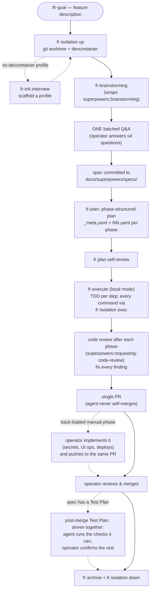
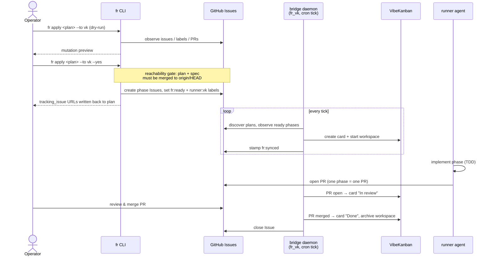

# super-fr

[](https://github.com/derio-net/super-fr/releases)
[](https://github.com/derio-net/super-fr/actions/workflows/ci.yml)
[](LICENSE)

**Describe a feature, get back a reviewed pull request.** Tell super-fr what you
want, answer one short round of questions, and an agent designs it, writes it
test-first, reviews its own work, and opens a single PR for you to merge — all
inside an isolated workspace that never touches your checkout.

It's two Claude Code plugins (plus a small CLI) that wrap
[superpowers](https://github.com/obra/superpowers) with phase-structured plans,
mandatory git-worktree + devcontainer isolation, and an optional path to fan a
plan's phases out to autonomous runners
([VibeKanban](https://github.com/BloopAI/vibe-kanban) today).

Built and dogfooded by [derio-net](https://github.com/derio-net); installable
anywhere Claude Code runs.

## Quickstart

### 1. Install

Recommended: run the full setup script. It installs the `fr` CLI, registers and
enables the Claude Code plugins, installs the rules/MCP config, and — when
OpenCode or Hermes Agent is present — installs the matching skills and slash
commands for those too. No manual checkout needed; it manages a hidden source
clone under `~/.cache/fr/src` and re-running updates it.

```bash
curl -fsSL https://raw.githubusercontent.com/derio-net/super-fr/main/scripts/bootstrap.sh | bash
```

Prefer to read it first?

```bash
curl -fsSL https://raw.githubusercontent.com/derio-net/super-fr/main/scripts/bootstrap.sh -o bootstrap.sh
bash bootstrap.sh
```

Claude Code: the installer registers the `derio-net` marketplace and enables
`super-fr@derio-net--super-fr` plus `super-fr-dispatch@derio-net--super-fr` for you.

OpenCode: the installer copies skills and slash commands when
`~/.config/opencode` already exists. On a fresh OpenCode setup, force that step
with `OPENCODE_SKILLS_INSTALL=1`.

Hermes Agent: the installer copies skills and wires the hooks/rules when
`~/.hermes` already exists. On a fresh Hermes setup, force that step with
`HERMES_SKILLS_INSTALL=1`. See [Hermes Agent](#hermes-agent) for what lands
where.

Just want the CLI? `uv tool install
'git+https://github.com/derio-net/super-fr#subdirectory=packages/fr'`.

### 2. Run your first goal

In any repo (super-fr scaffolds a devcontainer profile the first time if one is
missing):

```
/fr-goal add rate limiting to the webhook receiver
```

The agent isolates, brainstorms, asks its questions once, then drives
spec → plan → test-driven implementation → review → a single PR for you to
merge. That's the whole loop — everything below is detail you can reach for
when you need it.

## Skills

The two plugins ship eleven skills. Most of the time you only type `/fr-goal`
and the rest are invoked for you; this is the map of what each is and when it
fires.

### super-fr

| Skill | What it does | How invoked | When |
|-------|--------------|-------------|------|
| `fr-goal` | Brainstorm → spec → plan → TDD → reviewed PR, unattended | `/fr-goal <description>` | You want a feature built end-to-end without babysitting — the usual entry point |
| `fr-brainstorming` | superpowers brainstorming, inside isolation from the first command | `/fr-brainstorming` or auto (fr-goal step 1) | Designing a feature into a spec before building |
| `fr-debugging` | systematic-debugging in isolation → fix-PR | `/fr-debugging` or auto | A bug, failing test, or unexpected behavior to root-cause + fix |
| `fr-plan` | Phase-structured plan-as-folder + spec index | `/fr-plan` or auto (after a spec) | Turning an approved design into an executable plan |
| `fr-execute` | Implement one agentic phase (Phase > Task > Step), TDD | agent-facing; auto in fr-goal / dispatch | Carrying out assigned phase work (rarely called directly) |
| `fr-isolation` | Worktree + devcontainer lifecycle | `/fr-isolation` or auto | Running anything that must not touch your base checkout; post-merge cleanup |
| `fr-init` | Scan repo, interview, scaffold devcontainer profiles | `/fr-init` or auto (first isolated run) | First fr use in a repo with no devcontainer profile |
| `fr-progress` | Status board, drift audit, spec rollup | `/fr-progress` | "What's in progress?", auditing plan/spec drift |
| `fr-acceptance` | Backfill/maintain `docs/acceptance/matrix.yaml`, flip row statuses as evidence lands | `/fr-acceptance` or auto (session-start debt nag, `fr acceptance check` failure) | Backfilling a repo's business-level acceptance tests; keeping the acceptance CI gate honest |

### super-fr-dispatch

| Skill | What it does | How invoked | When |
|-------|--------------|-------------|------|
| `fr-dispatch` | Queue a merged plan's phases to a runner + reconcile Issues | `/fr-dispatch` (`fr apply --to <runner>`) | You merged a plan and want its phases run asynchronously |
| `fr-runner` | Operate/debug a runner: tick health, stuck phases, metrics | `/fr-runner` | A dispatched phase is stuck, or checking runner/bridge health |

## How it works

There are two ways work flows through super-fr. Both share the same artifacts —
a spec (`docs/superpowers/specs/`) and a plan-as-folder
(`docs/superpowers/plans/<slug>/`). **Flow 1** is one continuous agent session
working in isolation on your machine. **Flow 2** queues merged plan phases to a
runner that executes them asynchronously, one agent per phase.

### Flow 1 — goal to PR, locally (`/fr-goal`)

The operator describes a feature, answers one batched round of questions, and
gets back a single reviewed PR. Everything in between — brainstorming via
superpowers, spec, plan, TDD implementation, code review — runs autonomously
inside an isolated workspace.



Not quite everything is autonomous — two moments stay operator+agent driven
around the merge. Manual work (secrets, UI ops, deploys) is back-loaded into
the plan's last `[manual]` phase: the PR ships with it deliberately
unimplemented, and the operator implements it and pushes to the same PR.
(Front-loading is the rare exception, only when agentic work genuinely depends
on the manual output: the run opens a spec+plan PR — the manual instructions
are the deliverable — pauses, and resumes only on the operator's go.) And
when the deliverable deploys, the spec carries a post-merge **Test Plan**
(offered in the batched Q&A) that the agent drives interactively after the
merge — it runs the checks it can reach, the operator confirms what it can't —
before the run closes out with `fr archive` and `fr isolation down`.

### Flow 2 — dispatch phases to a runner (`fr apply --to vk`)

Once a plan is merged, its phases can be queued to a runner instead of being
executed locally. `fr apply` mirrors each phase to a tracking Issue; a cron
bridge daemon hands ready phases to VibeKanban, which spawns one agent
workspace per phase. Each phase comes back as its own PR.



> The diagram illustrates GitHub as the default backend; `fr` speaks GitLab
> (`glab`) and Gitea (`tea`) equally — see `docs/superpowers/specs/
> 2026-07-09-multi-backend-git-host-adapters-design.md`.

The flows compose: author a plan with Flow 1's front half (brainstorm → spec →
plan → merge), then fan its phases out to a runner with Flow 2. Without
`--to`, `fr apply` is tracking-only — Issues mirror the plan but no runner is
involved.

## Isolation: worktrees + devcontainers

Every run happens in an isolated workspace — there is **no unisolated
fallback**. Isolation is two layers:

- **Workspace isolation** — a git worktree at
  `~/.cache/fr/worktrees/<repo>/<branch>`, outside the base repo. The
  operator's checkout is never touched: no stray checkouts, stashes, or
  half-finished state.
- **Environment isolation** — a devcontainer per committed profile
  (`.devcontainer/<profile>/devcontainer.json` + `.devcontainer/fr-profiles.yaml`).
  Secrets stay host-side in `~/.config/fr/secrets/<repo>/<profile>.env` and are
  injected per profile, so a run only sees the credentials its profile grants.
  The default profile is least-privileged (e.g. `dev` with no tokens); an
  `admin` profile can carry `GH_TOKEN` for in-container pushes.

The lifecycle is a plain shell CLI any agent or human drives identically:

```bash
fr isolation up --branch feat/rate-limit --profile dev   # worktree + container
fr isolation exec --branch feat/rate-limit -- uv run pytest -q
fr isolation status                                      # worktree, container, PR state
fr isolation down --branch feat/rate-limit               # after the PR merges
```

**Exec-bridge discipline:** file edits happen on the host (the worktree is
host-visible); every build, test, lint, and run command goes through
`fr isolation exec -- …` inside the container. `down` refuses while the
linked PR is still open (unless `--force`), so cleanup can't race the
operator's final pushes.

**Where worktrees live.** Four things create worktrees; fr owns or routes all
of them, and knows which agent session holds each workspace:

| Creator | Location | State / session link |
|---|---|---|
| `fr isolation up` | `~/.cache/fr/worktrees/<main-checkout>/<branch-slug>` (keyed on the main checkout even when run from inside another worktree) | `<common-dir>/fr/isolation/<slug>.json` + per-session index `~/.cache/fr/sessions/<session-id>.json` |
| Claude native (`claude --worktree <name>`, `EnterWorktree`, desktop) | same fr location, branch `wt/<name>` — the `WorktreeCreate` hook calls `fr isolation up --session --print-path` | fr state, session bound in the same call |
| Agent tool `isolation: "worktree"` (`agent-*` names) | `<repo>/.claude/worktrees/agent-<id>` — Claude's default shape, reproduced by the same hook on purpose | Claude-internal (subagent only) |
| superpowers `using-git-worktrees` | routed to `fr isolation up` by the shipped rule `fr-worktree-override.md`; `<repo>/.worktrees/` is never created (CI tripwire) | fr state |

`fr isolation status` lists the sessions holding each workspace; the shipped
`plugins/super-fr/scripts/fr-statusline-segment.sh` renders the bound
workspace and the repo's other worktrees in the Claude Code status line
(wiring in the fr-isolation skill, "Session bindings").

A repo without a profile is a blocker, not a degraded mode: the `fr-init`
skill scans the repo, interviews the operator (profiles, tools, credential
key names, working patterns), and scaffolds profiles via `fr init scaffold`.
First run per repo pays this once.

## Reference

### `fr` CLI

Everyday:

| Command | Purpose |
|---------|---------|
| `fr apply` | Render + observe + diff + apply a plan to the repo's git host (dry-run by default; `--to <runner>` queues phases) |
| `fr status` | Read-only plan report (allowlist-safe; never mutates) |
| `fr acceptance` | Acceptance-matrix registry: `init`, `backfill`, `add`, `check`, `status`, `report` — see [Acceptance matrix](#acceptance-matrix) |
| `fr isolation` | Isolated workspaces: `up`, `exec`, `status`, `attach`, `detach`, `down`, `gc` |
| `fr plan` | Plan editing: `create`, `edit` (tick steps, complete phases), `self-review`, `rework` |
| `fr archive` | Move finished plans (and specs) to `implemented/` |
| `fr skills` | Condensed overview of the skills + CLI surface |
| `fr workflow` | `check <shape>` — validate a resolved workflow manifest (schema, duplicate ids, dangling `needs`, cycles, capabilities) |
| `fr run` | Durable workflow-run cursor: `start`, `status`, `advance`, `resolve`, `adopt`, `check` — see [Workflow shapes](#workflow-shapes) |

Maintenance:

| Command | Purpose |
|---------|---------|
| `fr init` | Devcontainer profile scaffolding (`scaffold`) |
| `fr repos` | Instrument locally-checked-out repos with a `plan-config.yaml` (`sync`; never clones) |
| `fr repair` | Normalize stale plan/spec refs **and strip dead `plan-config.yaml` keys** (dry-run; `--yes` to write) |
| `fr migrate` | `v1-to-v2` (plan format; also strips dead `plan-config.yaml` keys), `dirs`, and `artifacts` — bring every live artifact up to the version this `fr` writes (dry-run; `--yes` to apply, `--adopt` to give in-flight plans a run cursor) |
| `fr undispatch` | Close a plan's tracking Issues and null the fields |
| `fr validate` | `artifacts [--kind K]` — structural validation of every live artifact against the version this `fr` writes (read-only; CI-gated) |
| `fr pickup` | Output phase scope (markdown) for an agent |
| `fr spec` | Spec status reporting |

### Plan model

- **One plan = one repo's worth of work.** Plans live in the repo they modify.
- **PRs differ by flow.** Local (`/fr-goal`, Flow 1 above): every phase lands
  as commits on one branch, and the whole plan is delivered as a single PR.
  Dispatched (`fr apply --to <runner>`, Flow 2 above): each phase gets its own
  tracking Issue and its own PR, scoped for independent reviewability.
- **Cross-repo features use multiple plans**, coordinated through the shared
  spec's "Implementation Plans" section (maintained by `fr-plan`).

A plan is a folder, not a file:

```
docs/superpowers/plans/<YYYY-MM-DD-slug>/
├── _meta.yaml    # slug, spec ref, target repo, schema version
├── _prose.md     # human-readable narrative
├── 01.yaml       # phase 1: tasks + steps (P1.T1.S1 IDs), depends_on, tag
└── 02.yaml       # phase 2 …
```

### Workflow shapes

`/fr-goal [shape]` — and, at the CLI layer, `fr run` — drive a **workflow
shape**: a YAML manifest (`plugins/super-fr/workflows/<name>.yaml`, or a
repo override at `docs/superpowers/workflows/<name>.yaml`) declaring an
ordered list of steps, the decomposition **unit** they dispatch at
(`run`/`phase`/`spec`), and the runner **capabilities** they require. No
shape argument resolves `fr-goal` itself — today's TDD-feature pipeline,
unchanged.

```
fr run start <shape> --branch <b>   # resolve the shape, start the cursor
fr run advance <run-id>             # kind: cli executes; kind: agent emits a brief
fr run resolve <run-id> --step <id> --state done|failed [--emitted name=path]
fr run status <run-id>              # cursor + every step's state
fr run adopt <plan-dir|spec>        # give work already in flight a cursor (offered, not forced)
fr workflow check <shape>           # schema/graph validation (CI tripwire on every shipped shape)
```

Run state is git-tracked (`docs/superpowers/runs/<run-id>.yaml`, a sibling of
`journals/`) and archives alongside the plan it produced. See spec
`2026-08-14-workflow-shapes-and-workitem-dispatch-design.md` §4.A/§4.B.

**Where a shape name resolves**, in order — first hit wins:

1. `docs/superpowers/workflows/<name>.yaml` — this repo's override, wholesale;
2. `$FR_SHIPPED_WORKFLOWS_DIR/<name>.yaml` — the explicit escape, for tests and
   for harnesses that are not Claude Code;
3. the installed `fr` wheel's own copy (`fr/workflows/`) — ships **with** the
   `fr` that runs the shape, so the two cannot disagree;
4. `~/.claude/plugins/marketplaces/derio-net--super-fr/plugins/super-fr/workflows/`
   — the Claude Code plugin clone.

Source 3 is why `fr run start fr-goal` and `fr workflow check --all` work on a
host with **no** Claude Code marketplace clone (a hermes pod, an OpenCode
consumer, a bare `uv tool install fr`); it deliberately outranks the clone, so
upgrading `fr` without re-running `install.sh` cannot leave you silently
running a stale shape. `fr workflow check --all` **exits non-zero** when no
shape is discoverable anywhere — "nothing installed" is a broken installation,
not a clean bill of health.

### Label lifecycle

Phases queued to a runner (`fr apply --to <runner>`) carry exactly one
protocol-owned lifecycle label, projected from the tracked Issue's state on
every tick:

```
fr:ready ──→ fr:in-progress ──→ fr:pr-ready ──→ (closed)
   │
   └─ fr:blocked   while depends_on phases are incomplete
```

Plus two markers: `fr:synced` (handed to the runner — the idempotency stamp
that prevents re-dispatch) and `manual` (human-only phase, never routed to an
agent). Tracking-only Issues (no `--to`) carry no lifecycle label.

**Reachability gate:** `fr apply --yes` refuses to dispatch unless the plan
and spec are merged to `origin/HEAD` — the runner works from its own checkout
of main, so anything not on main would be invisible to it.

### Per-repo profile

Each repo can **optionally** define `docs/superpowers/plan-config.yaml` to set
the plan filename pattern, required headers, and status values the plan
validator enforces. It's read only by `scripts/validate-plans.sh`, which falls
back to sane defaults when the file is absent — so a repo works without it.

To drop this file into a set of already-checked-out repos at once — without
cloning anything — use `fr repos sync`:

```bash
fr repos sync derio-net/super-fr owner/other          # dry-run preview (default)
fr repos sync derio-net/super-fr owner/other --yes     # write plan-config.yaml in place
```

Repos resolve via `$FR_REPOS_DIR` / `~/repos/<name>` (a missing checkout is a
warning, not a failure) or a manifest at `~/.config/fr/repos.yaml`; positional
args are appended to that manifest unless `--no-save`. `fr repair` and
`fr migrate` also normalize this file, stripping any legacy keys the toolchain
no longer reads.

### Acceptance matrix

Business-level acceptance tests are tracked in `docs/acceptance/matrix.yaml` —
one row per acceptance ("operator can X"), cross-referenced against
unit/api/int/ui verification levels and an honesty-scale status: `ci` /
`scheduled` (automated, can't drift) → `skipped` (verified, but not in CI) →
`not-implemented` (nothing yet) → `failing` (known red, fails CI by design).

Rows are born at brainstorm time (presented with defenses in the batched
Q&A), linked to plan phases via an `acceptance: [row-ids]` field (`fr plan
self-review` errors on a Test-Plan spec with zero linked rows), and flipped
up the ladder as `fr plan edit --complete-phase` lands evidence — the CLI
warns on phases that complete without flipping their rows. Mid-flight
additions are expected (a missed edge, a review-found failure mode) and are
diffable against a base ref (`fr acceptance check --added-since <ref>`) and
defended in the PR body, never silent scope drift.

```bash
fr acceptance init        # scaffold matrix + CI workflow + backfill rule (idempotent)
fr acceptance backfill    # emit inventory + backfill protocol for an existing repo
fr acceptance add ...     # append a row (never hand-edit the YAML)
fr acceptance check       # validate refs/staleness/statuses; exit 2 on any `failing` row
fr acceptance status      # brief debt summary — surfaced at session start via a hook
```

Driven by the `fr-acceptance` skill; gated per-PR by
`.github/workflows/acceptance-report.yml`, which also upserts a weekly
"Acceptance debt" digest Issue.

### Hermes Agent

super-fr runs as a third agent harness alongside Claude Code and OpenCode:
[Hermes Agent](https://github.com/NousResearch/hermes-agent) by Nous Research.

**Install** (opt-in — runs automatically if `~/.hermes` exists):

```bash
HERMES_SKILLS_INSTALL=1 bash scripts/install.sh
```

**What lands where:**

| Artifact | Path | Notes |
|---|---|---|
| Skills | `~/.hermes/skills/fr/<name>/SKILL.md` | invoke as `/fr-goal`, `/fr-plan`, … |
| Rules | `~/.hermes/SOUL.md` | a delimited `<!-- super-fr:rules START/END -->` block; content outside it is never touched |
| Hooks | `~/.hermes/super-fr-hooks/` | copied tree; `config.yaml` `hooks:` entries point at it |
| Approvals | `~/.hermes/shell-hooks-allowlist.json` | pre-recorded so non-TTY runs register without a prompt |

The invasive, reversible parts (the `config.yaml` `hooks:` merge, the
allowlist, the SOUL.md block) are done by a tested subcommand rather than by
shell, and are fully undone by its inverse:

```bash
fr hermes install   --source <super-fr checkout> [--home ~/.hermes]
fr hermes uninstall --source <super-fr checkout> [--home ~/.hermes]
```

`scripts/install.sh --uninstall` calls the latter and removes
`~/.hermes/skills/fr`. Only super-fr's own files are touched.

**Enforcement.** Hermes's shell-hooks bridge speaks the same block protocol as
the Claude Code hook, so the isolation guards are the *same scripts*, gating
`pre_tool_call` for both edits (`write_file`/`patch`) **and** bash
(`terminal`/`execute_code` — git/gh mutations outside isolation, and pushes to a
merged PR's branch). A first-turn `pre_llm_call` context hook surfaces open
acceptance debt (Hermes 0.18.x discards `on_session_start` return values). Escapes
are unchanged: `fr isolation up`, `.fr-isolation-allow`, `FR_BASE_OK=1`.

**Models.** super-fr ships **no** Hermes model bindings on purpose —
`fr models resolve --harness hermes --tier <t>` stays unbound so `fr-goal` asks
you for a model per tier on the first run and persists it with `fr models set`.

**Phase execution.** Under Hermes, `fr-goal` dispatches each plan phase with
`delegate_task(goal, context)`. Hermes subagents start with a fresh
conversation, so the whole journal-fed brief travels in `context` — which is
exactly how fr-goal's handoff already works.

Working *on* this repo with Hermes? [`HERMES.md`](HERMES.md) is the project
context file (it outranks `AGENTS.md`, so read both).

### Components

| Package | What it is |
|---------|------------|
| `fr` | The CLI: plan-as-folder engine, git-host tracking (GitHub/GitLab/Gitea — render → observe → diff → apply), isolation, `fr hermes` install |
| `fr-dispatch` | Runner protocol + tick framework (library, runner-agnostic) |
| `fr-vk` | VibeKanban adapter: MCP client, card/workspace dispatch, bridge daemon |
| `fr-cncd` | CNC daemon runner adapter |
| `fr-opencode-plugin` | OpenCode `tool.execute.before` port of the isolation edit guard |
| `plugins/super-fr/hooks/hermes/` | Hermes `pre_tool_call` ports of the isolation edit + bash/push guards |

## Requirements

- [superpowers](https://github.com/obra/superpowers) plugin (super-fr wraps its
  brainstorming, TDD, and review skills)
- Your repo's forge CLI, authenticated: [GitHub CLI](https://cli.github.com/)
  (`gh`, the default), [GitLab CLI](https://gitlab.com/gitlab-org/cli) (`glab`),
  or [Gitea's `tea`](https://gitea.com/gitea/tea) — whichever the repo's
  `.devcontainer/fr-profiles.yaml` `backend:` key (or its git remote) resolves to
- Docker (devcontainers for isolation)
- [uv](https://docs.astral.sh/uv/) (for the `fr` CLI)
- [VibeKanban](https://github.com/BloopAI/vibe-kanban) MCP server — only for
  dispatch (`npx vibe-kanban@latest --mcp`)

## For maintainers

Contributor workflow, the release/version-bump rule, the bridge-audit rule, and
the CI gate are documented in [`AGENTS.md`](AGENTS.md) (imported by `CLAUDE.md`
for Claude Code sessions).
